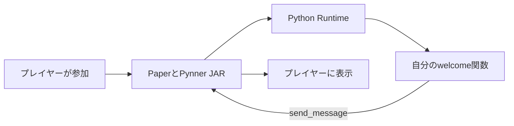

# 要素の関係

[目次](index.md) | 次：[導入](getting-started.md)

## 用意する四つのもの

Pynnerを使うには、Paperに入れるJARと、Pythonに入れる二つのパッケージ、それから自分のスクリプトを用意します。
それぞれ置く場所が異なります。

| 要素 | 役割 | 置く場所 |
|---|---|---|
| `pynner-paper-0.1.0.jar` | Paperの出来事を受け取り、ゲームの状態を変更する | サーバーの`plugins/` |
| `pynner`（SDK） | Pythonで使う関数、クラス、型を提供する | サーバー用Pythonへpipで導入 |
| `pynner-runtime` | `.py`を読み込み、関数を呼び出す | SDKと同じPythonへpipで導入 |
| 自分の`.py` | 武器、Mob、イベント処理などを定義する | `plugins/Pynner/scripts/`以下 |

**wheel**は、pipでインストールできるPythonパッケージのファイル形式です。
配布ZIPの`dist/`にSDK用とRuntime用の`.whl`が入っています。
SDKは`import pynner`に必要で、Runtimeはサーバーがスクリプトを実行するために必要です。

## 挨拶が届くまで



PythonはPaperとは別のプロセスで動きます。
関数が使う`Player`は、Minecraftのプレイヤーへ操作を依頼するための参照です。
PythonからPaperのJavaオブジェクトを直接呼び出す方式ではありません。

サーバー起動時にJARがRuntimeを起動するので、通常はRuntimeを手動で起動する必要はありません。
`.py`を普通のPythonから実行しても、Minecraftへの接続は作られません。

## ファイル、定義、実体の違い

武器のPythonクラスは、武器の作り方と振る舞いを定義します。
`/pynner give fire_sword`を実行すると、その定義からゲーム内のアイテムを作ります。
Mobも同じで、Pythonクラスを登録しただけではワールドへ出現しません。

| 段階 | 武器 | Mob |
|---|---|---|
| ファイルを保存する | `fire_sword.py` | `boss_zombie.py` |
| 定義を登録する | `@weapon("fire_sword")` | `@mob("boss_zombie")` |
| ゲーム内で作る | `/pynner give fire_sword` | `/pynner spawn boss_zombie` |
| 後から処理が呼ばれる | `on_hit`など | `on_damage`など |

IDは`fire_sword`のような内部名です。
表示名の「炎の剣」とは別で、英小文字、数字、アンダースコアだけを使います。
ファイル名やクラス名を変えても、IDが同じなら同じ定義として扱います。

## クラスのselfに保存する値

武器とMobのクラスは、定義ごとに一つのPythonインスタンスを作ります。
同じ定義から作った複数の武器やMobが、そのインスタンスを共有します。
`self.counter`に保存した値は、剣一本やMob一体だけの値にはなりません。

Entityごとの値には`entity.uuid`をキーにした辞書や、[PDC](api.md#追加データを保存する)を使います。
Pythonの辞書はreloadすると失われます。
この版のSDKには、任意のアイテムインスタンスへ後からPDCを書き込む操作はありません。

## 読み取りと変更の違い

`player.health`を読むと、通知を作った時点のHPが返ります。
`player.health = 20`は、Java側へHPの変更を依頼します。
代入してすぐに読み直しても、Pythonが持つ値は更新されません。

```python
async def recover(player):
    await player.set_health(20)  # ゲーム側での完了を待つ
    await player.refresh()      # 読み取り用の値を取り直す
    player.send_message(f"今のHPは{player.health}")
```

`await`を使う関数は、`async def`で定義します。
完了を待たずにメッセージを送るだけなら、普通の`def`で書けます。
具体的な操作一覧は[操作API](api.md)にあります。
