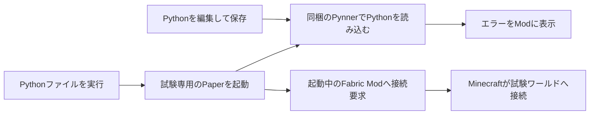

# Fabric 1.21.11でPythonを試す

[目次](index.md)

Minecraftを起動したままPythonを実行すると、試験用のワールドへ自動接続できます。
Pythonを保存すると機能を読み込み直し、エラーはターミナルとゲーム画面で確認できます。
実際のPaperとPynnerをローカルで動かすので、本番と同じ武器、Mob、イベント、コマンドの実装を使います。

## 動作の仕組み



このModはシングルプレイの内部サーバーをPaperへ置き換えません。
ユーザー操作としてはローカルの試験ワールドへ入りますが、Minecraft上の分類はlocalhostへのマルチプレイ接続です。
本番サーバーのpluginsや既存ワールドへ、試験スクリプトを配置する必要はありません。

## 初回だけ行う設定

### Modを入れる

Fabric LoaderでMinecraft **1.21.11**を使い、Fabric APIを入れます。
同梱ModのJARは`dist/pynner-debug-fabric-0.1.0.jar`です。
これを使用するMinecraftインスタンスの`mods/`へコピーします。
Paper用JARをMinecraftのmodsへ入れる必要はありません。

通常の公式ランチャーなら、Windowsの候補は`%APPDATA%/.minecraft/mods/`です。
ランチャーやプロファイルでゲームディレクトリを変えている場合は、そのインスタンスのmodsを使ってください。
ソースからの検証環境では、Fabric Loader 0.19.5、Fabric API 0.141.6+1.21.11を使っています。
Modの最低Loaderバージョンは0.18.4です。
他のModとのすべての組み合わせを確認したわけではありません。

### 普段のPythonへインストールする

展開先が`D:/pynner`の場合、PowerShellで実行します。
仮想環境を作らず、普段のPythonを使う例です。
環境を分けたい場合は[Python環境](python-environment.md)のvenv手順を使えます。

```powershell
Set-Location D:/pynner
python -m pip install dist/pynner-0.1.0-py3-none-any.whl dist/pynner_runtime-0.1.0-py3-none-any.whl dist/pynner_debug-0.1.0-py3-none-any.whl
```

SDK、Runtime、Debugの三つを同じPythonへ入れます。
Debug wheelには試験用のPynner Paper JARを同梱しています。
既存Pythonへ入れ直す場合は、古い0.1.0が残らないようpipに`--force-reinstall`を付けます。

### Paperの場所を指定する

Paper 1.21.11のserver.jarと、Java 21以上を用意します。
初回の設定はユーザーごとの`~/.pynner/debug/config.json`へ保存します。

```powershell
python -m pynner_debug configure --paper-jar D:/paper-1.21.11/server.jar --java 'C:/Program Files/Java/jdk-21/bin/java.exe' --accept-eula
```

`--accept-eula`は[Minecraft EULA](https://aka.ms/MinecraftEULA)に同意した場合に指定します。
指定したJARと同じフォルダーに、すでに`eula=true`のeula.txtがある場合は、この引数を省けます。
Javaのパスは実際のインストール場所に置き換えてください。
Paper本体は配布ZIPへ含めていません。

設定に使った元サーバーのワールドやpluginsはコピーしません。
JARと起動キャッシュだけを試験専用フォルダーで使います。
librariesなどの変更しないバイナリは、可能ならhard linkで容量を抑えます。

## Pythonを実行して入る

1. Modを入れたMinecraftを起動します。
2. タイトル画面で待ちます。
3. Pythonでサンプルを実行します。

```powershell
python examples/debug_demo.py
```

新しいflatワールドを作り、Creativeモードで接続します。
Paperの初回起動にはダウンロードやワールド生成の時間がかかる場合があります。
起動待ちの上限は120秒です。
すでに別のワールドやサーバーへ入っている場合は、タイトルへ戻るよう案内し、勝手には切り替えません。

参加後は次を試せます。

```text
/pynner give debug_blade
/pynner spawn debug_target
/debugerror
```

剣と練習用Mobを作り、`debugerror`で意図的なPython例外を出します。
Survivalで戦闘を試したい場合は、`/gamemode survival`で切り替えられます。
サンプルの文字列を書き換えて保存すると、Hot Reloadで反映します。

Pythonを実行したターミナルでCtrl+Cを押すと、Minecraftを試験ワールドから切断して、試験用Paperを停止します。
通常の停止ではワールドとログを保存します。
Minecraft自体は起動したままです。
IDEがPythonを強制終了した場合も、試験用Paper側で親プロセスの終了を検出して停止します。
OS全体の強制終了時などに保存を保証する仕組みではありません。

## 自分のファイルを直接実行できるようにする

作ったPynnerスクリプトの末尾へ、次を追加します。

```python
if __name__ == "__main__":
    from pynner.debug import run
    run(__file__)
```

これで`python 自分のファイル.py`や、対応するPython環境を選んだエディターの実行ボタンを使えます。
Paperがスクリプトとして読み込むときには、このブロックは実行しません。
コードを本番のscriptsへ移しても、このブロックがデバッグ環境を再帰起動することはありません。

ファイルを変更せずに使う場合は、CLIから指定します。

```powershell
python -m pynner_debug C:/my-project/fire_sword.py
```

武器とMobを組み合わせるなど、複数のエントリースクリプトが必要ならフォルダーを指定します。

```powershell
python -m pynner_debug C:/my-project/scripts
```

ファイル指定では、そのファイルと同じフォルダーの`_`で始まる補助Pythonファイルだけをコピーします。
同じフォルダーの別の通常スクリプトを、自動では登録しません。
補助関数を通常の名前のモジュールへ置く場合や複数定義を使う場合は、フォルダー指定にしてください。
`.`で始まる環境フォルダー、node_modules、venv、build、target、__pycache__を除外します。

## デバッグ画面を見る

ゲーム内で**F8**、または`/pynnerclient`を使います。
キーはMinecraftの操作設定から変更できます。
画面には状態、元のスクリプトパス、試験フォルダー、Runtime情報、最後のエラー、最近のログを表示します。
`Reload Python`ボタンで手動reloadできます。
ワールド内の左上にも状態と最後のエラーを表示します。

ログは画面サイズに収まる最後の行を表示し、長い行は省略します。
tracebackの全文はターミナルまたは保存したログで確認してください。
この初期版にはbreakpoint、変数のステップ実行、専用のEntity／Weapon Inspectorはありません。

別ターミナルから接続状態を確認したり、試験ワールドへコマンドを送ることもできます。

```powershell
python -m pynner_debug clients
python -m pynner_debug --command 'pynner status'
```

コマンド送信はModが接続したローカル試験ワールドだけで使えます。
本番やほかの接続先へコマンドを転送する機能にはしません。

## 複数のクライアントを使う

各OSユーザーが自分のMod、Python、設定を用意します。
試験サーバーとModの制御ポートは自動で空きポートを選ぶため、別々のクライアントの試験は独立しています。
同じユーザーでMinecraftを複数起動している場合は、どれを操作するか指定します。

```powershell
python -m pynner_debug clients --client <クライアントID>
python -m pynner_debug ./scripts --client <クライアントID>
```

指定せず複数見つかった場合は、ID一覧を表示して停止します。
IDは`~/.pynner/debug/clients/`の記述ファイル名から拡張子を外したものです。
ファイルには認証トークンが含まれるので、内容を公開しないでください。

## 保存先と後片付け

試験ごとに`~/.pynner/debug/sessions/<ID>/`を新規作成します。
Windowsの`~`は通常`C:/Users/<ユーザー名>`です。
元のPythonファイルは変更せず、編集内容を試験フォルダーのscriptsへコピーします。

| ファイル | 内容 |
|---|---|
| `launcher.log` | Paper起動から終了までの標準出力 |
| `logs/latest.log` | Paperのログ |
| `plugins/Pynner/logs/` | Python世代ごとのログ |
| `world/`など | 試験用ワールド |

新規ワールドを使うので、前回の個体を誤って使うことを避けられます。
保存データは自動削除しません。
容量が増えたら、停止済みのセッションフォルダーを手動で削除できます。
設定ファイルの`memory`は既定`2G`で、configure時の`--memory 3G`などで変更できます。

## 接続できないとき

| 症状 | 対処 |
|---|---|
| `Fabric ... must be running` | Minecraftのバージョン、modsの保存先、Mod読込ログを確認 |
| `Return ... title screen` | いま入っているワールドを通常操作で終了する |
| `Multiple clients found` | 表示されたIDを`--client`で指定する |
| EULAのエラー | 同意状態を確認し、必要ならconfigureの`--accept-eula`を指定 |
| 起動タイムアウト | launcher.logを確認。Java、Paperバージョン、ネット接続、Python importを確認 |
| Minecraftが閉じるとPaperも止まる | クライアントを監視する意図した動作 |
| エラーが画面で省略される | launcher.logかPythonのログで全文を見る |

## 実装に使った公式資料

Fabricの[1.21.11向け案内](https://www.fabricmc.net/2025/12/05/12111.html)、[Loom](https://docs.fabricmc.net/develop/loom/)、[MinecraftClient API](https://maven.fabricmc.net/docs/yarn-1.21.11+build.4/net/minecraft/client/MinecraftClient.html)、[ConnectScreen API](https://maven.fabricmc.net/docs/yarn-1.21.11+build.4/net/minecraft/client/gui/screen/multiplayer/ConnectScreen.html)を参照しました。
